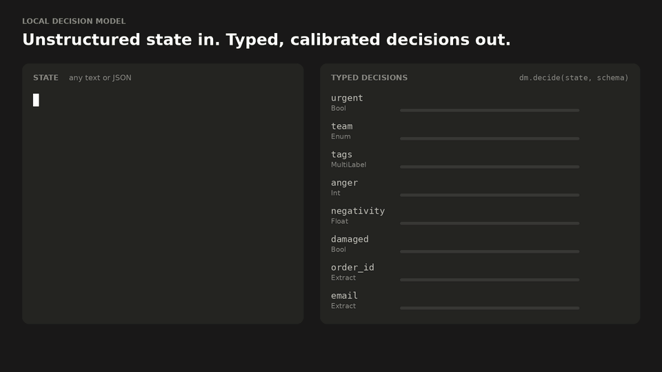
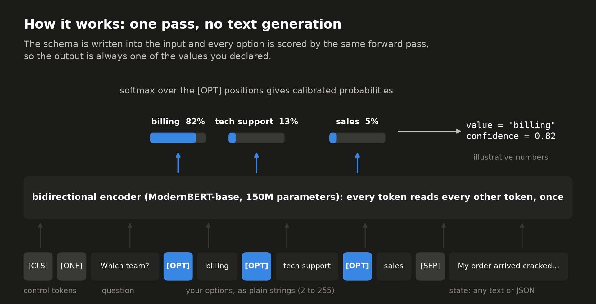
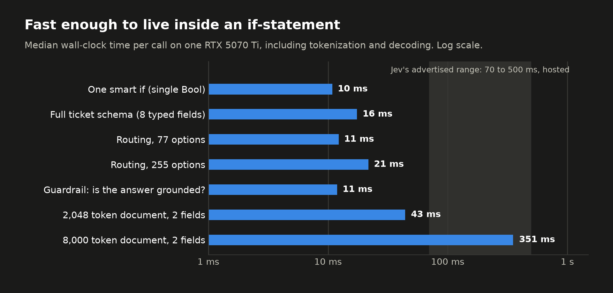
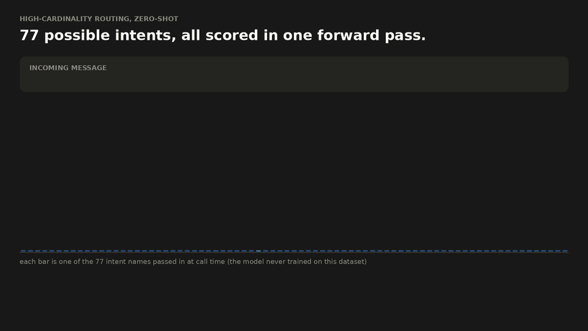
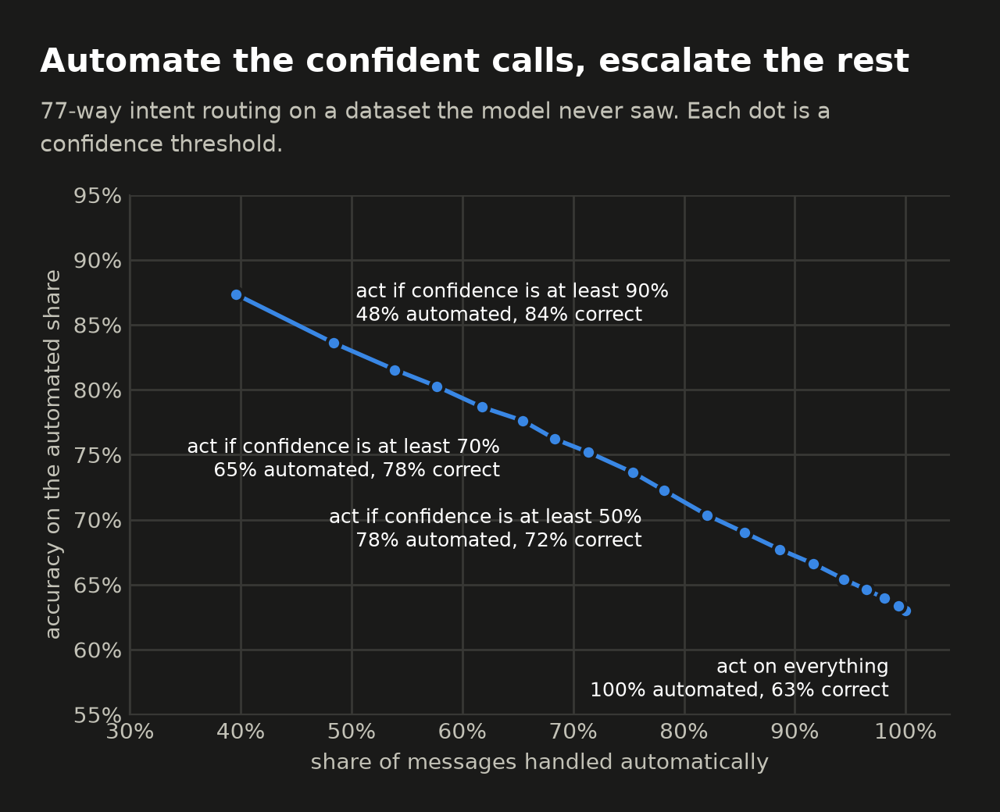
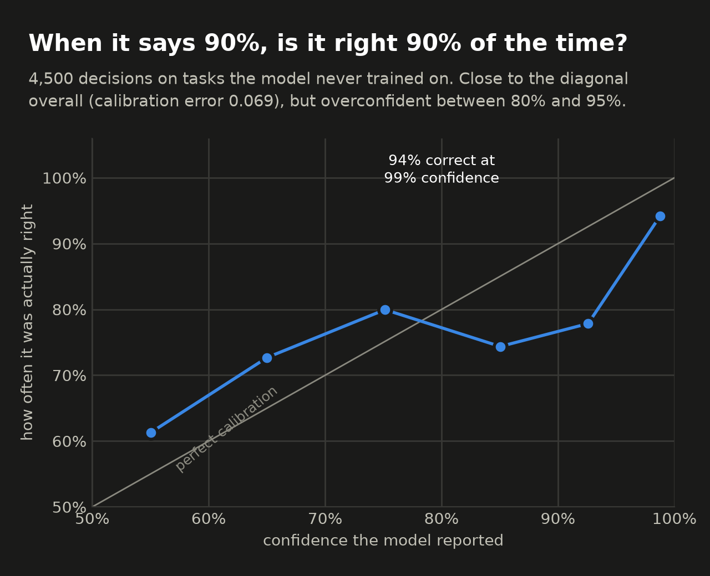
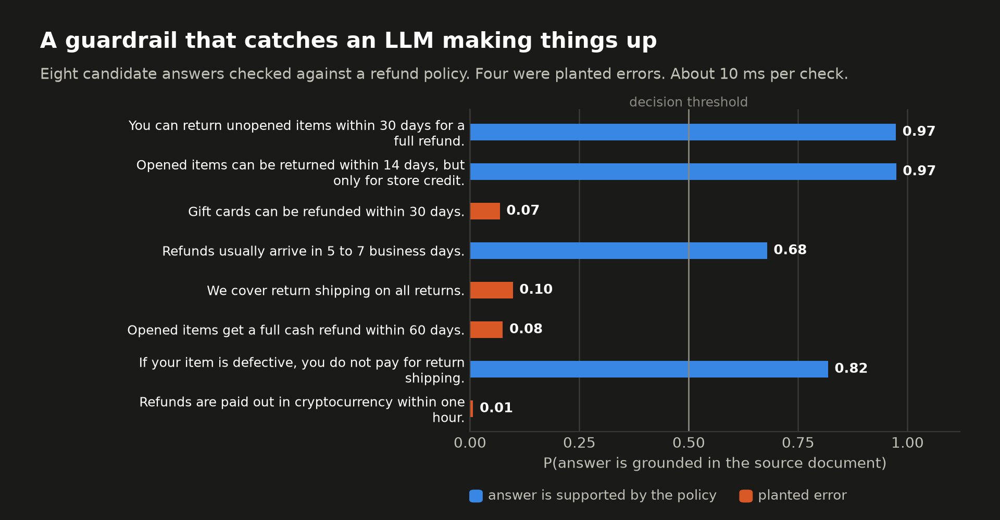

# local-decision-model

A small, fast, local decision model: **unstructured state in, typed probabilistic decisions out.**



<sub>Animation not playing? See a [still frame](assets/hero.png).</sub>

This repo is a generic decision model inspired by the blog post that introduced
[Jev, the "System One Model" from TypeSafe AI](https://typesafe.ai/blog/introducing-system-one-models-and-jev).
It is an independent project built only from that public post. "Jev" in this README always means TypeSafe's model,
never ours. It trains a 150M parameter model on public HuggingFace datasets, runs entirely on one consumer NVIDIA GPU,
and answers a whole schema of typed questions about a piece of text in roughly 15 milliseconds.

```python
from decisionmodel import DecisionModel, Bool, Enum, MultiLabel, Int, Extract

dm = DecisionModel.load()  # loads checkpoints/decision-model

ticket = "My order #48213 arrived with a cracked screen. Refund me today or I dispute the charge. dana.kim@example.org"

d = dm.decide(ticket, {
    "urgent":   Bool("Does this need a response within the hour?"),
    "team":     Enum("Which team should handle this ticket?", ["billing and refunds", "technical support", "sales"]),
    "tags":     MultiLabel("Which of these apply?", ["refund request", "damaged product", "positive feedback"]),
    "anger":    Int("How angry is the customer, from 1 (calm) to 5 (furious)?", 1, 5),
    "order_id": Extract("What is the order number?"),
})

if d.urgent.p() > 0.7 and d.team.value == "billing and refunds":   # a "smart if-statement"
    escalate(order=d.order_id.value, confidence=d.team.confidence)
```

Every field comes back as a `Decision` with a typed `value`, a `confidence`, and the full probability
distribution in `probs`. A `Bool` is always a Python `bool`. An `Enum` is always one of the strings you declared.
An `Extract` is always a verbatim substring of the input, or `None`.

## Why we built this

Large language models are "System 2" tools: they reason slowly, one token at a time, and produce free text.
Most automation inside software does not need that. It needs thousands of small judgment calls:
is this ticket urgent, which queue does it belong to, is this prompt a jailbreak, does this answer match the source document.
TypeSafe's post argues that these calls deserve their own class of model, which they call a System One Model
(after Kahneman's *Thinking, Fast and Slow*), and it describes Jev with these properties:

| Property described for Jev | What it means |
| --- | --- |
| Unstructured state in, typed decisions out | You pass text or program state plus a schema. You never parse model output. |
| Cannot make type errors | Outputs are chosen from a closed set defined in advance, so there is nothing to hallucinate. |
| Calibrated probabilities | Every answer carries a probability that you can threshold, rank, or sum. |
| Parallel sampling | All outputs come from one query, not from token-by-token generation. |
| 70 to 500 ms end to end | Fast enough to sit in a request path or a UI. |
| Very cheap per input token, output is free | Suitable for map-reduce over large datasets. |
| Up to 255 options per choice | High-cardinality routing in one call. |

Jev is a hosted, early access product, and the post does not disclose its architecture, size, or training data.
We wanted the same programming model on our own machine: no network hop, no per-token bill, no data leaving the box,
and a code base small enough to read in one sitting. This repo is the result. It is **not** Jev and makes no claim to
match Jev's quality. It reproduces the interface and the performance envelope with well-understood parts.

## How the model works

### One pass, no generation



The model is a bidirectional transformer encoder ([ModernBERT-base](https://huggingface.co/answerdotai/ModernBERT-base),
150M parameters, 8,192 token context) with two tiny heads on top. Each schema field becomes one input sequence:

```
[CLS] [MODE] question [OPT] option 1 [OPT] option 2 ... [SEP] state text [SEP]
```

* `[MODE]` is one of three control tokens that tells the model how to answer: pick exactly **one** option,
  judge **any** subset of options independently, or point at a **span** of the state.
* Each `[OPT]` token marks one candidate answer. After the encoder runs, the hidden vector at each `[OPT]` position
  is passed through a small MLP that produces one score per option. All options are scored **at the same time**,
  in the same forward pass, because attention lets every option read the question, the state, and the other options.
* For extraction, a second head scores every state token as a possible start or end of the answer.
  The `[CLS]` position stands for "the state does not contain an answer".

All fields of a schema (and all states in a batch) are stacked into one batched forward pass. There is no decoding loop,
so latency does not depend on how much you ask for, only on how much text the model has to read. This is our version
of what the Jev post calls a parallel sampler.

### Types, and why they cannot break

| Type | Python value | How it is decoded |
| --- | --- | --- |
| `Bool(question)` | `bool` | softmax over the fixed options `yes` / `no` |
| `Enum(question, choices)` | one of `choices` | softmax over your options (2 to 255) |
| `MultiLabel(question, choices)` | `list` of `choices` | independent sigmoid per option |
| `Int(question, lo, hi)` | `int` in range | softmax over the integers; also returns the expected value |
| `Float(question, lo, hi, bins)` | `float` in range | softmax over evenly spaced grid points; returns the expected value |
| `Extract(question)` | substring or `None` | best (start, end) pair over state tokens, copied out by character offset |

The model never emits text. It only assigns scores to options you declared, or to positions in your own input.
Decoding then picks from that closed set, so a value outside the declared type is impossible by construction,
no matter what the input says. Two more details make this robust:

* Control tokens are inserted by id, never parsed from text. If user text contains the literal spelling of a reserved
  token (such as `[SEP]`, or `[unused0]`, the vocabulary slot we use for `[OPT]`), it is replaced with `[UNK]` before
  the model sees it, so input text cannot forge schema structure.
* The schema always comes first in the sequence, so truncating a very long state never drops an option.

This is also why the "0% hallucination" claim in the Jev post is less magical than it sounds: a model with no free text
output has nothing to hallucinate with. It can still be **wrong**, which is why calibrated confidence matters.

### Training data

`scripts/build_data.py` downloads about 50 public HuggingFace datasets and rewrites every example into the query format
above. The mixture has roughly one million examples across these families:

* **Arbitrary predicates** (natural language inference: MNLI, SNLI, ANLI, FEVER-NLI, plus BoolQ). These teach the
  general skill behind a smart if-statement: given some text, is this claim true?
* **Classification and routing**: sentiment, emotion, topics, intents (up to 150 options), support ticket routing,
  and about 120 further tasks from the tasksource zero-shot collection.
* **Guardrails**: toxicity, hate speech, spam, jailbreaks and prompt injections.
* **Numeric scales**: star ratings, inverted scales ("how angry"), graded toxicity from annotator agreement, sentence similarity.
* **Multi-label**: GoEmotions, toxicity subtypes, entity types present in a sentence, sets of claims supported by a
  passage, messages that cover two topics at once, and single-label data recast as "which of these apply" with the
  true label sometimes absent.
* **Multiple choice reading comprehension**: RACE, CommonsenseQA.
* **Extraction**: SQuAD v2 (with unanswerable questions), named entities from Few-NERD, and synthetic business fields
  (order numbers, emails, amounts, dates, tracking codes) planted into real customer support messages.

The goal is a model that follows the *question and option names you give it at call time*, not one that memorizes
datasets. So each example is randomly varied: the question wording, the label names and their casing
(`Billing`, `billing`, `BILLING_ISSUE`), the subset and order of options, optional "none of the above" choices,
and sometimes the state is wrapped as JSON to look like program state.

### Calibration

All three modes train with log loss, which is a proper scoring rule: the loss is minimized only by reporting honest
probabilities. After training, `scripts/train.py` fits a temperature per mode. For single-choice questions the
temperature is fit on **tasks the model never trained on** (`data/calib.jsonl`), and may grow with the logarithm of the
number of options. The reason: users bring new tasks, and a model is systematically more overconfident on an unfamiliar
task than on its own validation data. Fitting on unseen tasks corrects for the regime the model is actually used in.
The Jev post describes a reinforcement learning method for calibration (RLCD) without publishing details;
ours is the simple supervised equivalent.

## Results

All numbers below come from one NVIDIA RTX 5070 Ti (16 GB) under WSL2, with the model in bfloat16.
Raw outputs are saved in `results/`.

### Speed



Wall-clock time per call, including tokenization and decoding:

| Scenario | p50 | p95 |
| --- | --- | --- |
| One smart if-statement (single `Bool`) | 9 ms | 18 ms |
| Full ticket schema, 8 typed fields, one call | 15 ms | 25 ms |
| Routing against 77 options | 10 ms | 15 ms |
| Routing against 255 options (Jev's stated maximum) | 17 ms | 21 ms |
| Input guardrail / output guardrail | 9 ms / 10 ms | 16 ms / 17 ms |
| 2 fields over a 2,048 token state | 44 ms | 46 ms |
| 2 fields over an 8,000 token state | 351 ms | 353 ms |

Jev advertises 70 to 500 ms end to end. Typical calls here finish in 10 to 25 ms, and even a full 8K token context
stays inside Jev's range. Jev's figures include a network round trip and ours do not, so read this as "comfortably
inside the same envelope", not as "faster than Jev". The median is steady; the tail moves a few milliseconds with
desktop GPU sharing, because a model this small is limited by CPU kernel launches rather than by GPU arithmetic.

Bulk throughput (experiment 3): **1,500 decisions per second** on short news articles and **about 94,000 input tokens
per second** on long reviews. A billion input tokens takes about 3 GPU hours on this one consumer card.

### Quality on tasks the model never trained on

Every dataset in this table was excluded from training, and any training example whose text also appears in one
of them was removed (79 examples). Questions and option names were passed as plain strings at call time.
ECE is the expected calibration error of the reported confidence (lower is better, 0 is perfect).

| Held-out task | Type | Options | Accuracy | ECE |
| --- | --- | --- | --- | --- |
| IMDB movie reviews | `Bool` | 2 | 94.4% | 0.016 |
| AG News topics | `Enum` | 4 | 74.0% | 0.049 |
| Banking77 customer intents | `Enum` | 77 | 63.0% (top 3: 80.2%) | 0.133 |
| Twitter financial news sentiment | `Enum` | 3 | 74.1% | 0.215 |
| SMS spam, asked as "Is this message spam?" | `Bool` | 2 | 64.9% (AUROC 0.94) | 0.182 |
| SMS spam, asked with a precise definition (see below) | `Bool` | 2 | 89.4% (AUROC 0.96) | |
| deepset prompt injections | `Bool` | 2 | 69.6% (AUROC 0.87) | 0.272 |
| SQuAD v2 dev, extraction (training split was seen, dev split was not) | `Extract` | | 82.8% exact match, F1 85.8 | 0.107 |
| Two-topic AG News pairs | `MultiLabel` | 4 to 6 | AUROC 0.86, F1 0.60 | |
| Two-intent Banking77 pairs | `MultiLabel` | 8 to 10 | AUROC 0.94, F1 0.77 | |



<sub>Animation not playing? See a [still frame](assets/routing_escalate.png) of the low-confidence case.</sub>

| | |
| --- | --- |
|  |  |



Every number in these images is a real model output. `scripts/collect_visual_data.py` runs the model and saves the
results to `assets/data.json`, and `scripts/make_visuals.py` renders from that file. We left the misses in: the first
ticket in the animation gets a spurious "login problem" tag (shown in orange, because the model reports low confidence),
and one routing example is wrong at 49% confidence, which is exactly the case the escalation rule exists for.

How to read this honestly:

* On well-defined tasks (sentiment, extraction, grounding checks) the model is accurate and well calibrated out of the box.
* On 77-way routing it is right 63% of the time with zero examples (chance is 1.3%), and its confidence is useful:
  if you only automate calls with confidence of at least 0.9, you automate 48% of traffic at 83.6% accuracy and
  escalate the rest (experiment 2).
* Where accuracy is low, the ranking is usually still good (AUROC 0.87 to 0.96) and the miss is one of **definition**.
  "Spam" is vague, and the model over-flags slangy personal texts. Asking
  *"Is this SMS an advertisement, a prize scam or a paid subscription offer?"* lifts accuracy from 65% to 89% on the same
  data. We chose that second wording after looking at errors, so treat it as an illustration of prompt sensitivity, not
  as a clean benchmark number. Likewise most AG News misses are tech-company business stories, which that dataset files
  under Sci/Tech and the model files under business.
* On unfamiliar threshold-style tasks the model can be overconfident (prompt injections: mean confidence 0.97 at 70%
  accuracy, with precision 0.98 but recall 0.24). Pick thresholds on a few of your own examples.

### The five experiments

Each script in `experiments/` is a runnable usage example that ends with explicit pass/fail checks.
All five pass on the shipped checkpoint; their full output is in `results/experiments/`.

| # | Scenario from the Jev post | What it shows |
| --- | --- | --- |
| 1 | Smart if-statements, real-time UX | One ticket, 8 typed fields (every type), plain Python branching on probabilities. 15 ms per call. |
| 2 | Routing, high cardinality | 77 and 255 options scored in one pass on a held-out dataset, plus confidence-based escalation. |
| 3 | Map-reduce over large datasets | 15,200 decisions in 10 s, then a reduce step that sums probabilities into expected counts. |
| 4 | Guardrails and verification of LLM output | Zero-shot injection detection, a grounding check that catches 8 of 8 planted errors, and an attack on the guard itself. |
| 5 | Calibration and type safety | Reliability table on held-out tasks (ECE 0.069), 209 garbage and hostile inputs with 0 type violations, latency up to 8K tokens. |

### How this compares with Jev

| | Jev (as described) | local-decision-model (measured) |
| --- | --- | --- |
| Interface | state + typed schema in, typed probabilistic values out | same |
| Type errors | never | never, by construction (fuzz tested) |
| Latency | 70 to 500 ms end to end, hosted | 10 to 25 ms typical, 350 ms at 8K tokens, local |
| Max options | 255, with a two-stage process for large sets | 255 in a single pass |
| Text generation | none | none |
| Calibration | RL for Calibrated Decisions (unpublished) | log loss training plus temperature fit on unseen tasks |
| Intelligence | claimed comparable to frontier LLMs on System One tasks | a 150M encoder: good on clear-cut judgments, weak on subtle or multi-step ones |
| Architecture, data, size | undisclosed | ModernBERT-base + 2 heads, about 1M public examples, 150M parameters |

The last two rows are the important ones. We matched the programming model and the speed. We did not, and with a
150M parameter model could not, match the quality that TypeSafe claims for Jev.

## Reproducing everything

The short version is one command: `bash scripts/reproduce.sh` (about two hours on an RTX 5070 Ti).
[REPRODUCING.md](REPRODUCING.md) explains every step, its runtime and output, and what to do when something fails.

Requirements: Linux (or WSL2), an NVIDIA GPU with 16 GB of memory, and [uv](https://docs.astral.sh/uv/).

```bash
uv sync                                         # creates .venv with PyTorch (CUDA) and friends
uv run python scripts/build_data.py             # about 15 minutes, writes data/*.jsonl
uv run python scripts/train.py --out checkpoints/decision-model-stage1      # stage 1: about 70 minutes on an RTX 5070 Ti

# stage 2: a 10 minute refresh that upweights multi-label tasks, then average the two stages and recalibrate
uv run python scripts/make_stage2.py
uv run python scripts/train.py --data data/stage2 --init-from checkpoints/decision-model-stage1 --lr 2e-5 --head-lr 1e-4 --out checkpoints/decision-model-stage2
uv run python scripts/average_checkpoints.py --out checkpoints/decision-model checkpoints/decision-model-stage1 checkpoints/decision-model-stage2
uv run python scripts/train.py --calibrate-only --out checkpoints/decision-model

uv run python scripts/evaluate.py               # zero-shot evaluation on held-out datasets
uv run python scripts/eval_multilabel.py        # held-out multi-label check
uv run python scripts/collect_visual_data.py && uv run python scripts/make_visuals.py   # images and GIFs in assets/
uv run pytest                                   # fast unit tests, no GPU needed
cd experiments && for f in 0*.py; do uv run python $f; done
```

If training is interrupted, continue with `--resume-from <checkpoint dir>`; the batch order is deterministic, so the
run picks up exactly where the last saved checkpoint left off. Stage 1 alone (`--out checkpoints/decision-model`) already gives a
usable model.

`pyproject.toml` pins uv to its own managed Python builds. Those ship C headers, which PyTorch needs in order to
compile its Triton GPU kernels; many system Pythons do not.

To trade speed for quality, train a larger encoder with
`uv run python scripts/train.py --backbone answerdotai/ModernBERT-large --token-budget 3500`.

## Repo layout

```
src/decisionmodel/types.py      the type specs (Bool, Enum, ...) and the Decision result
src/decisionmodel/encoding.py   query -> token ids, control tokens, anti-forgery cleaning, batching
src/decisionmodel/model.py      encoder + option head + span head, save/load
src/decisionmodel/api.py        DecisionModel.decide / decide_many / check, and typed decoding
scripts/build_data.py      builds the training mixture from HuggingFace datasets
scripts/train.py           training loop, resume, and calibration
scripts/make_stage2.py     builds the small stage 2 refresh set
scripts/average_checkpoints.py  averages checkpoints from the same lineage
scripts/evaluate.py        zero-shot evaluation on held-out datasets
scripts/eval_multilabel.py held-out multi-label evaluation
scripts/collect_visual_data.py, make_visuals.py   real model outputs -> assets/data.json -> images and GIFs
scripts/reproduce.sh       rebuilds everything end to end
REPRODUCING.md             step by step reproduction guide and troubleshooting
results/                   saved evaluation numbers and experiment outputs
assets/                    images and GIFs used in this README
experiments/               five runnable demonstrations with pass/fail checks
tests/                     unit tests for types, encoding and decoding
```

## Tips for good results

* Write questions and option names the way you would explain the task to a new colleague.
  `"billing and refunds"` works better than `"cat_3"`.
* Use probabilities, not just values. `d.field.p()` on a `Bool` is a risk score you can threshold, rank, or sum.
* For "how likely is X" use `Bool` and read its probability. Use `Int` / `Float` for "how much" questions about degree.
* Route low-confidence decisions to a human or a larger model. Experiment 2 shows the accuracy you buy by doing so.
* One call with many fields is much cheaper than many calls with one field.

## Limitations, honestly

* **It is a small model.** It handles judgments a person could make at a glance. It is weak at implied or conditional
  meaning. Example: for a ticket saying "refund me today or I will dispute the charge", the question
  "Is this customer threatening to leave, cancel or dispute a charge?" gets P(yes) = 0.01. The model seems to read
  "threat" as violent threat, a bias inherited from toxicity datasets. Concrete questions ("Did the product arrive
  damaged?" gets 0.98) work far better than abstract ones.
* **Wording matters.** The same task can swing 25 points of accuracy with a more precise question (see SMS spam above).
  Test your schema on a handful of real examples before trusting it.
* **`MultiLabel` is the weakest type.** It tends to under-predict when several options are true at once
  (it flags 20% of options where 38% are true on our held-out test). A second training stage improved this but did not
  solve it. When a tag really matters, ask it as its own `Bool`.
* **Calibration is good on average, not guaranteed per task.** ECE is 0.02 to 0.05 on familiar kinds of task and
  0.13 to 0.27 on some unfamiliar ones.
* **`Int` and `Float` are coarse.** They were trained on star ratings, graded toxicity and sentence similarity.
  They order things sensibly but are not precise instruments. For "how likely", use the probability of a `Bool`.
* **English only**, and extraction returns a single contiguous span (no lists, no normalization of dates or amounts).
* **Not a security boundary.** The type guarantee is structural and cannot be talked out of, but the guardrail
  *decisions* can be wrong. Layer them with other defenses.
* **How the shipped checkpoint was made.** Stage 1 trained for one epoch (66 minutes, including a resume after a GPU
  driver crash at 95%) on the mixture before the three multi-positive tasks were added. Stage 2 continued for 10 minutes
  on those tasks plus a 15% replay sample. Stage 2 helped `MultiLabel` but slightly hurt some yes/no tasks, so the shipped
  model is the plain average of the stage 1 and stage 2 weights, recalibrated. Running the commands above from scratch
  includes the multi-positive tasks in stage 1 as well, so your numbers will differ slightly.
* **Evaluation hygiene.** Held-out datasets were never trained on and were decontaminated by exact text match. However,
  we looked at held-out errors between training rounds to decide which *kinds* of public data to add
  (more task variety, more injection styles, numeric scales). That is weaker than a fully blind evaluation.
* Everything we know about Jev comes from one blog post. Any resemblance of internals is a guess.
